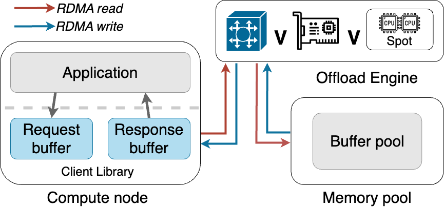

# cowbird
## Description

cowbird is a memory disaggregation architecture that frees compute servers to lfill their stated purposes by remoting disaggregation-related logc from their CPUs. The figure below illustates the architecture of a Cowbird system. An offload engine is responsible for actually executing data transfers between the compute node and memory pool. Currently, we have two implementation verions of cowbird: cowbird-spot (offload engine is running on CPUs of memory nodes); cowbird-p4 (offload engine is running in the programmable switch). 
<p align="center">
  
</p>

## Hardware

Programmble switch: Wedge100BF-32X Tofino switch with `bf-sde-9.2.0`.

RDMA NIC: Mellanox Technologies MT27800 Family [ConnectX-5].

## Software
/cowbird-p4: p4 offload engine code. 

/cowbird-FASTER: spot offload engine code; FASTER (a key-value store application) running with cowbird. 

## How to run 
### cowbird-p4
#### On Programmble switch

1. compile the p4 program

```console
cxinyic@localhost:~/cowbird-p4/p4v16$ python make.py cowbird_p4.p4 /home/cxinyic/cowbird/p4v16/out
```

2. Launch the switchd daemon
```console
cxinyic@localhost:~/cowbird-p4/p4v16$ python make.py switchd /home/cxinyic/cowbird/p4v16/cowbird.cpp /home/cxinyic/cowbird/p4v16/out/ -t 0x1234 -g 59 -p 0x11
```
3. Run control plane and application related logic. (Use FASTER as an example)
```console
cxinyic@localhost:~/cowbird-p4/p4v16$ python faster_rdma.py
```
### cowbird-spot and other baselines
#### On compute node 

1. cmake and compile

Create new directories "build/Release" from "cowbird-FASTER/cc", run
```console
cxinyic@compute_server:~/cowbird-FASTER/cc/build/Release$ cmake -DCMAKE_BUILD_TYPE=Release ../..
```
2. make
```console
cxinyic@compute_server:~/cowbird-FASTER/cc/build/Release$ make -j
```

3. run the benchmark. Usage: benchmark.exe <workload> <# threads> <load_filename> <run_filename>
```console
cxinyic@compute_server:~/cowbird-FASTER/cc/build/Release$ ./benchmark 0 1 load_data run_data
```
4. One-sided Async/sync
   
replace the file from `cowbird-FASTER/cc/src/one-sided/rdma_common.h` to `cowbird-FASTER/cc/src/core/rdma_common.h` and recompile

`ASYNC` is a macro and the default is set to be `ASYNC`. 

#### On memory node 
1. make
```console
cxinyic@compute_server:~/cowbird-FASTER/cc/src/device$ make 
```
2. run
```console
cxinyic@compute_server:~/cowbird-FASTER/cc/src/device$ ./cowbird_p4_server or ./cowbird_spot_server or ./one_sided_server
```


